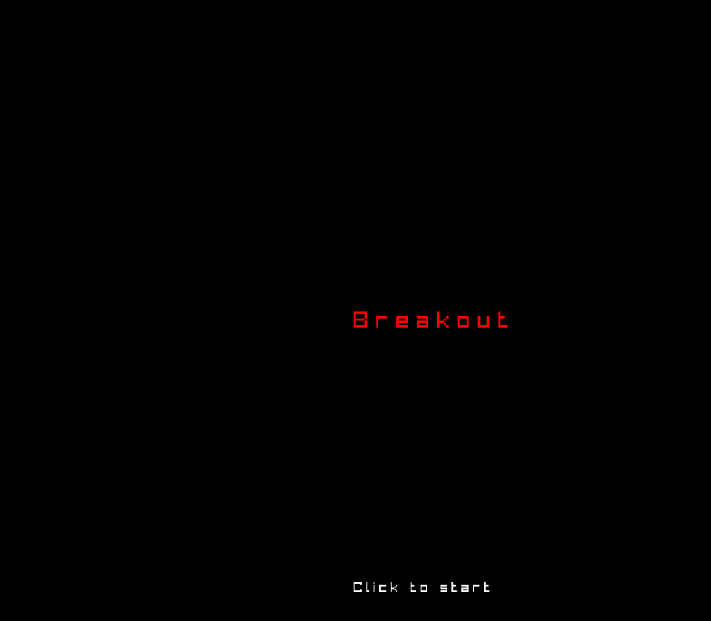
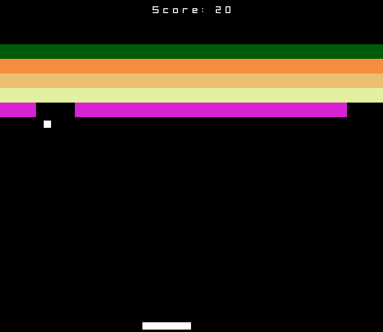

# C Breakin

A simple Breakout clone written in C using the [raylib](https://www.raylib.com/) library.




## Description

This project is a classic Breakout game where the player controls a paddle to bounce a ball and destroy tiles. The game features:
- A menu, win, and game over screens.
- Score tracking.
- Lives system.

## Prerequisites

To build and run this game, you need to have `raylib` installed on your system.

### Linux
On most Linux distributions, you can install raylib using your package manager or by following the [installation instructions](https://github.com/raysan5/raylib/wiki/Working-on-GNU-Linux).

## Building the Project

You can compile the project using `gcc`. From the project root, run:

```bash
gcc main.c -o breakin -lraylib -lGL -lm -lpthread -ldl -lrt -lX11
```

## Running the Game

After building, you can run the executable:

```bash
./breakin
```

## Controls

- **Left/Right Arrow Keys**: Move the paddle.
- **Up Arrow Key**: Launch the ball when it's attached to the paddle.
- **Left Mouse Click**: Start the game from the menu or restart after winning/losing.

## Assets

- `Planet Jumbo.otf`: Font used for the game text.
